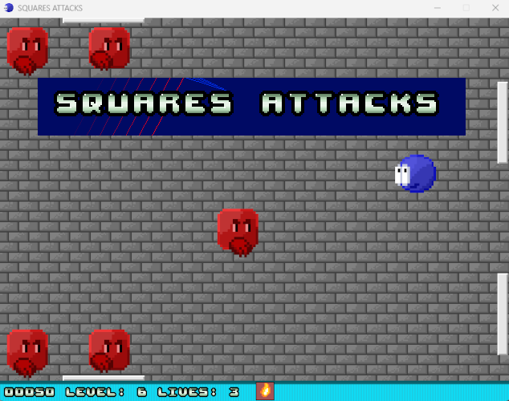

## SQUARES ATTACKS ##

2D retro action pixel art game programmed in python programming language using pygame library
https://www.pygame.org

## Python Installation ##

Install python programming language https://www.python.org/
After it

    python -m pip install -U pygame --user

## Start game

python start.py

## License

The programmed is free to use.
The code is licensed after GPL
https://www.gnu.org/licenses/lgpl-3.0

For asset attributions see [ATTRIBUTIONS.TXT](ATTRIBUTIONS.TXT)

## Making Distribution

Use pyinstall

    python -m pip install -U pyinstall --user
    pyinstall square_attacks.spec

In dist you will find the destribution

 